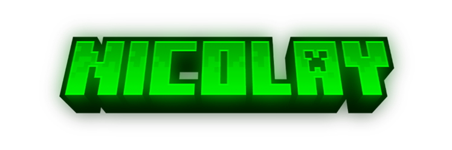
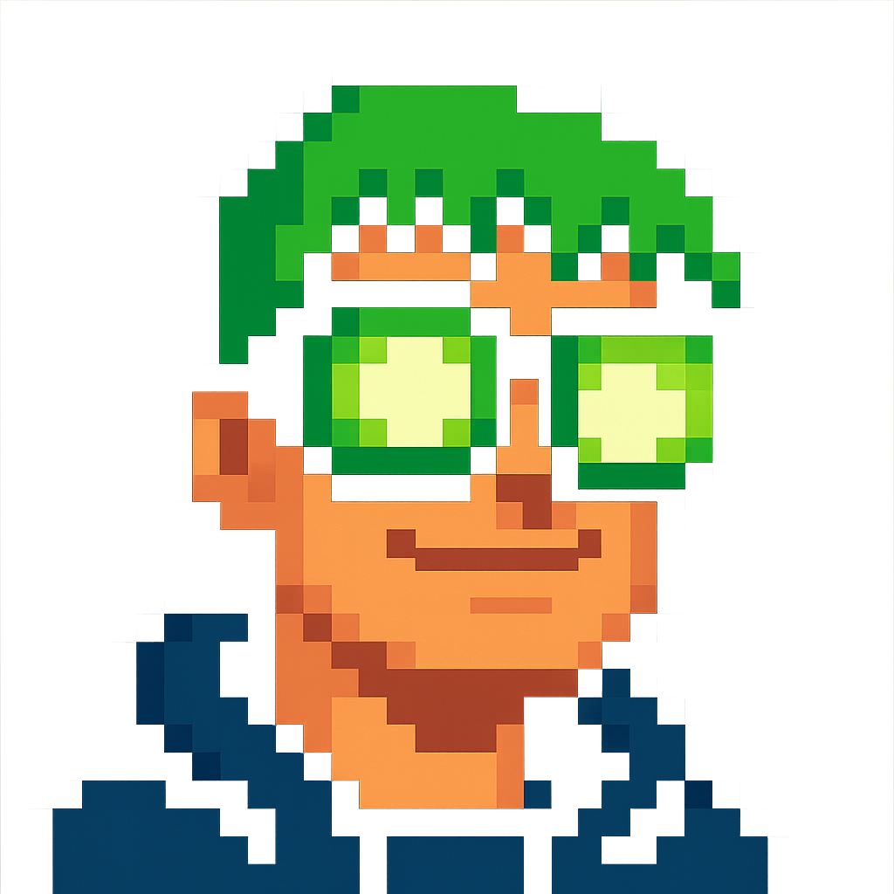

Hi there, I'm

   

#

#
Hello! I’m a Software Engineering student with a comprehensive focus on web application development as a Fullstack Developer. I combine the power of code with the creativity of design to build complete, functional, and visually impactful digital experiences. 

I have a strong background in graphic design applied to web development, which allows me to create applications that not only work well but also look amazing and communicate clearly. I'm passionate about designing clean, modern, user-centered interfaces, paying attention to every detail—from typography to color palette.

My design style is unique, authentic, and full of character. I like every project to have its own identity and express personality. I strongly believe that a good interface should not only be beautiful but also functional, accessible, and memorable. 

When it comes to development, I’m proficient in both frontend and backend, enabling me to build complete solutions—from an initial idea to deployment in production. I work with modern technologies and up-to-date practices that ensure performance, scalability, and security. 

I'm a creative, curious, and detail-oriented person. I love exploring new technologies, constantly learning, and collaborating on projects where quality, aesthetics, and innovation meet.

  

#

#

<!--
**NicoIay/NicoIay** is a ✨ _special_ ✨ repository because its `README.md` (this file) appears on your GitHub profile.

Here are some ideas to get you started:

- 🔭 I’m currently working on ...
- 🌱 I’m currently learning ...
- 👯 I’m looking to collaborate on ...
- 🤔 I’m looking for help with ...
- 💬 Ask me about ...
- 📫 How to reach me: ...
- 😄 Pronouns: ...
- ⚡ Fun fact: ...
-->
